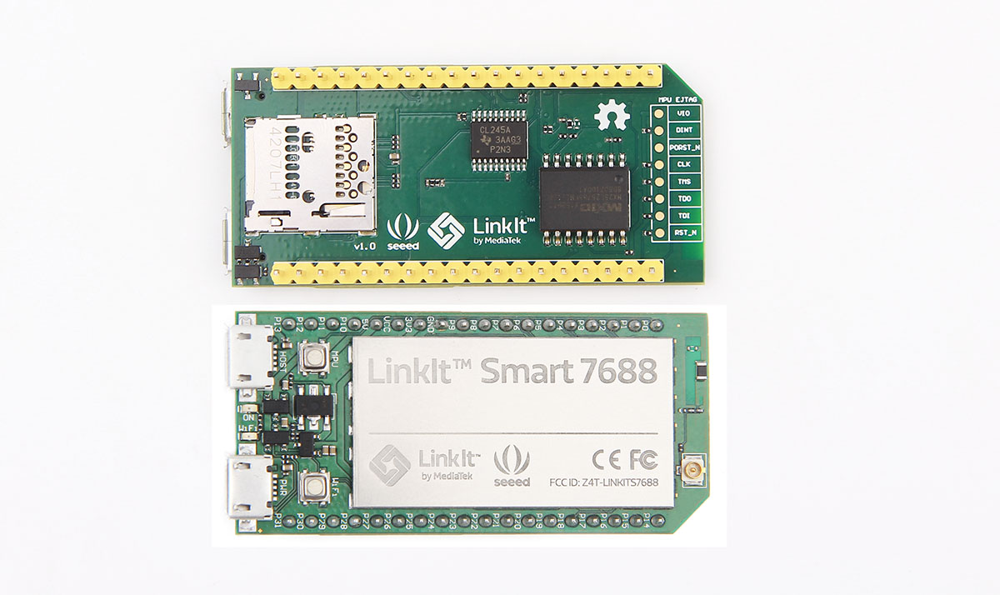

# [fit] Welcome!
# Functional Firmware with Nerves

---

# The Plan

 - Make sure you've got the required software
 - Set up your board
 - Burn some firmware
 - Get started with GPIO and LEDs
 - Get started with Phoenix
 - ???
 - Fun!
 
---

# Linkit Smart 7688

---
# Linkit Smart 7688
## Vital Specs

 - 580Mhz MIPS processor
 - 128MB RAM
 - 32MB Flash
 - 22 GPIO pins
 - 802.11n WiFi
 
---

# [fit] Defining Terms

---

# Defining Terms
 - host
 - target
 - toolchain
 - system
 
---
# Host

## The computer on which you are editing source code, compiling, and assembling firmware.

---
# Target

## The platform for which your firmware is built (for example, Raspberry Pi, Raspberry Pi 2, or Beaglebone Black)

---
# Toolchain

## The tools required to build code for the target, such as compilers, linkers, binutils, and C runtime

---
# System

## A lean Buildroot-based Linux distribution that has been customized and cross-compiled for a particular target

---
# [fit] Nerves

---
# Nerves Build Process

---

 
